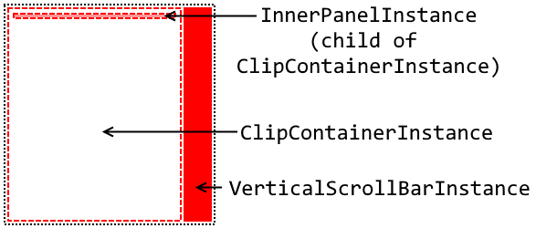
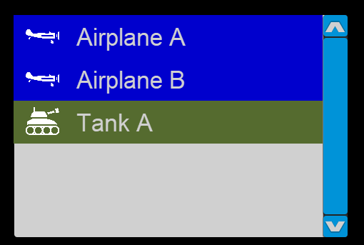
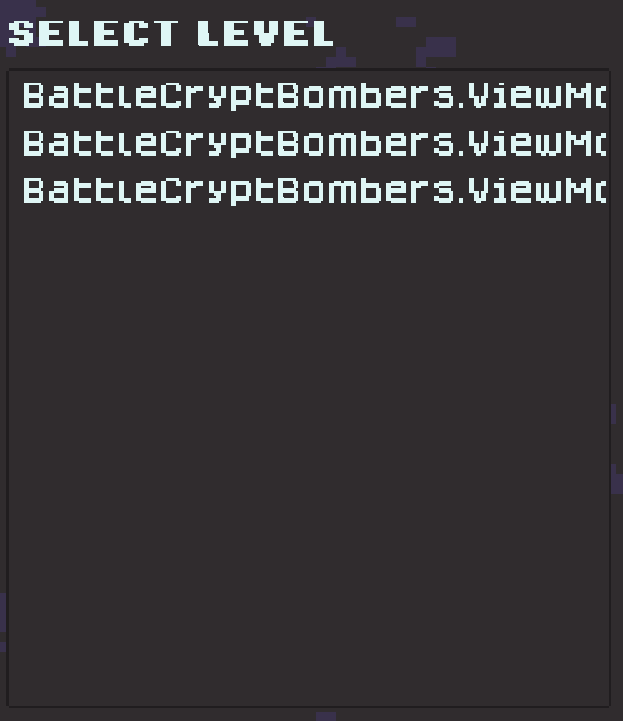
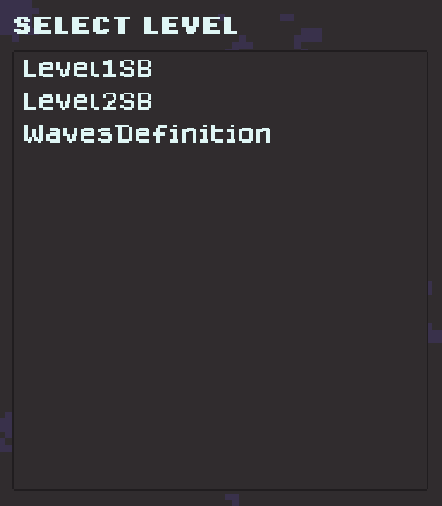

# listbox

### Introduction

The ListBox is a scrollable view which displays multiple ListBoxItem instances. When one ListBoxItem is selected, the previously-selected ListBoxItem becomes deselected. 

<figure><figcaption></figcaption></figure>

 ListBox inherits from [ScrollViewer](scrollviewer.md).

### Layout Requirements

The ListBox control requires:

* An object named **VerticalScrollBarInstance** which implements ScrollBarBehavior (is a ScrollBar)
* An object named **InnerPanelInstance** of any type (typically a Container)
* An object named **ClipContainerInstance** of any type (typically a Container with **ClipsChildren** set to true)

[](../../../media/2017-12-img_5a465ac0d252b.png) The requirements for the ListBox are identical to the requirements for the ScrollViewer control. For more information on requirements, see the ScrollViewer page: [http://flatredball.com/documentation/tutorials/flatredball-forms/forms-layout-in-gum/scrollviewer/](../../../documentation/tutorials/flatredball-forms/forms-layout-in-gum/scrollviewer.md)

### InnerPanelInstance and Children Layout

The ListBox control typically handles the creation and positioning of ListBoxItem instances. The InnerPanelInstance in the list box Gum component will typically use a **Children Layout** value of **TopToBottomStack.** [](../../../media/2017-12-img_5a46645375a35.png) Alternatively the InnerPanelInstance can use a **Children Layout** value of **LeftToWriteStack** with the **Wraps Children** value set to true.


### Items

Items represents the data that the ListBox is managing. Items can either contain regular types (such as strings, ints, or classes representing data in your game like data for a car in a racing game), or instances of ListBoxItems. Whenever an object is added to the Items collection the list box will automatically update its visuals to display the newly-added object. If the newly-added object is a regular type, then the ListBox will internally construct a new ListBoxItem. If the newly-added object is already a ListBoxItem, then the ListBox will display the ListboxItem as-is. This allows games to conveniently add non-ListBoxItems or to construct ListBoxItems for full control.

### Items.Add with ListBoxItemGumType

Any object type can be added to a ListBox.  The following code shows how to add strings to the Items property, resulting in the list box displaying a single entry for each item.

```lang:c#
var listBox = TutorialScreenGum
    .GetGraphicalUiElementByName("ListBoxInstance")
    .FormsControlAsObject as ListBox;

// Optional - you can specify a ListBoxItemGumType if you do not want to use
// the default list box item type.
listBox.ListBoxItemGumType = typeof(GumRuntimes.ListBoxItemRuntime);

listBox.Items.Add("Ford");
listBox.Items.Add("Chevrolet");
listBox.Items.Add("Dodge");
listBox.Items.Add("Honda");
listBox.Items.Add("Toyota");
listBox.Items.Add("Mitsubishi");
```

By default Glue will generate code for a default ListBoxItemGumType, so the line above is optional. If you would like the list box to have a custom ListBoxItem type, you can specify it as shown in the code above. If specified, the ListBoxItemGumType should be a Gum runtime type which has the ListBoxItem behavior.

### Items.Add with Manual ListBoxItem Construction

ListBoxItem instances can be manually instantiated and added to a list box, as opposed to relying on the default or explicitly specified ListBoxItemGumType. The following code shows how to manually create and add ListBoxItems. Note that the same Items list is used when adding ListBoxItem instances.

```lang:c#
var listBox = TutorialScreenGum
    .GetGraphicalUiElementByName("ListBoxInstance")
    .FormsControlAsObject as ListBox;


// Note that we could also shorthand this
// to not explicitly create a visual object:
// var listBoxItem = new GumRuntimes.ListBoxItemRuntime().FormsControl;
var visual1 = new GumRuntimes.ListBoxItemRuntime();
var listBoxItem = visual1.FormsControl;
listBoxItem.UpdateToObject("Leather Armor");
// Notice that this code is adding the listBoItem, which is
// a FlatRedBall.Forms.Control.ListBoxItem. It is not adding the gum runtime
listBox.Items.Add(listBoxItem);

var visual2 = new GumRuntimes.ListBoItemRuntime();
var listBoxItem2 = visual2.FormsControl;
listBoxItem2.UpdateToObject("Chain Mail");
listBox.Items.Add(listBoxItem2);

var visual3 = new GumRuntimes.ListBoxItemRuntime();
var listBoxItem3 = visual3.FormsControl;
listBoxItem3.UpdateToObject("Full Plate");
listBox.Items.Add(listBoxItem3);
```

### Mixing ListBoxItem Types

A single ListBox can contain multiple types of ListBoxItems. Multiple types can be used by explicitly instantiating ListBoxItems using different Gum runtime types, or by setting the ListBoxItem property multiple times. The following code shows how to instantiate ListBoxItems using different Gum runtimes:

```lang:c#
var listBox = TutorialScreenGum
    .GetGraphicalUiElementByName("ListBoxInstance")
    .FormsControlAsObject as ListBox;


var listBoxItem = new GumRuntimes.AirplaneListItemRuntime().FormsControl;
listBoxItem.UpdateToObject("Airplane A");
listBox.Items.Add(listBoxItem);

var listBoxItem2 = new GumRuntimes.AirplaneListItemRuntime().FormsControl;
listBoxItem2.UpdateToObject("Airplane B");
listBox.Items.Add(listBoxItem2);

var listBoxItem3 = new GumRuntimes.TankListItemRuntime().FormsControl;
listBoxItem3.UpdateToObject("Tank A");
listBox.Items.Add(listBoxItem3);
```

 Icons in screenshot obtained from [http://game-icons.net/](http://game-icons.net/) . The same could be achieved by setting the ListBoxItemGumType before calling AddItem, as shown in the following code:

```lang:c#
var listBox = TutorialScreenGum
    .GetGraphicalUiElementByName("ListBoxInstance")
    .FormsControlAsObject as ListBox;

listBox.ListBoxItemGumType = typeof(GumRuntimes.AirplaneListItemRuntime);
listBox.Items.Add("Airplane A");
listBox.Items.Add("Airplane B");

listBox.ListBoxItemGumType = typeof(GumRuntimes.TankListItemRuntime);
listBox.Items.Add("Tank A");
```

Note that using ListBoxItemGumType does require less code, and may be sufficient for many scenarios requiring different ListBoxItem runtimes.

### Customizing ListBoxItems

The ListBox provides a number of ways to customize a ListBox.

#### ViewModel ToString

By default each instance added to the ListBox's Items (either directly or through binding) will have its ToString method called. If strings are added to Items, then the string's contents is displayed automatically. If a non-primitive type is added, then its ToString will (by default) display the type of the object which is usually not desirable.



If the class is a ViewModel that is custom-made for UI, then its ToString can be modified as shown in the following code:

```
public class SBWaveDefinitionViewModel : ViewModel
{
    public string Name { get; set; }

    public override string ToString()
    {
        return Name;
    }
}
```



#### ListBoxItemFormsType

The ListBox control also allows specifying the Forms control to create, which can customize behavior and display logic. For information on creating and using custom ListBoxItem types, see the [ListBoxItem](listboxitem.md) page.

### Selection

The selected item can be controlled using a number of properties.

#### SelectedItem

The SelectedItem property gets and sets the selected item. Setting this value will select the first matching instance found in the Items property. The following code example adds three strings, then selects the second one:

```lang:c#
listBox.Items.Add("a");
listBox.Items.Add("b");
listBox.Items.Add("c");

listBox.SelectedItem = "b";
```

Items can be deselected by setting the SelectedItem to null;

```lang:c#
listBox.SelectedItem = null;
```

SelectedIndex The SelectedIndex property gets and sets the index of the currently selected item. A value of -1 indicates no selection. The following code example shows how to deselect the selected item in a ListBox:

```lang:c#
listBox.SelectedIndex = -1;
```

### SelectionChanged Event

The SelectionChanged event is raised whenever a selection changes due to a mouse click or code change of the SelectedItem or SelectedIndex. The event provides a list of newly-selected items and deselected items. Note that at the time of this writing only a single item can be selected at a time, but future versions of FlatRedBall.Forms may add multi-selection support. The following code example shows how to react to the selection changing on a ListBox:

```lang:c#
void CustomInitialize()
{
    var listBox = TutorialScreenGum
                .GetGraphicalUiElementByName("ListBoxInstance")
                .FormsControlAsObject as ListBox;

    // Adding items omitted from example

    listBox.SelectionChanged += HandleSelectionChanged;
}

private void HandleSelectionChanged(object sender, SelectionChangedEventArgs args)
{
    foreach(var removed in args.RemovedItems)
    {
        FlatRedBall.Debugging.Debugger.CommandLineWrite("Deselected " + removed.ToString());
    }
    foreach (var added in args.AddedItems)
    {
        FlatRedBall.Debugging.Debugger.CommandLineWrite("Newly Selected " + added.ToString());
    }
}
```


<figure><figcaption></figcaption></figure>

 The event handling the selection changing can also use the SelectedItem  property, as shown in the following code:

```lang:c#
void CustomInitialize()
{
    var listBox = TutorialScreenGum
                .GetGraphicalUiElementByName("ListBoxInstance")
                .FormsControlAsObject as ListBox;

    // Adding items omitted from example

    listBox.SelectionChanged += HandleSelectionChanged;
}

private void HandleSelectionChanged(object sender, SelectionChangedEventArgs args)
{
    var listBox = sender as ListBox;
    
    // This is casted as an object, so you may need to cast it back to the expected type
    var selectedItem = listBox.SelectedItem;

}
```

&#x20;
