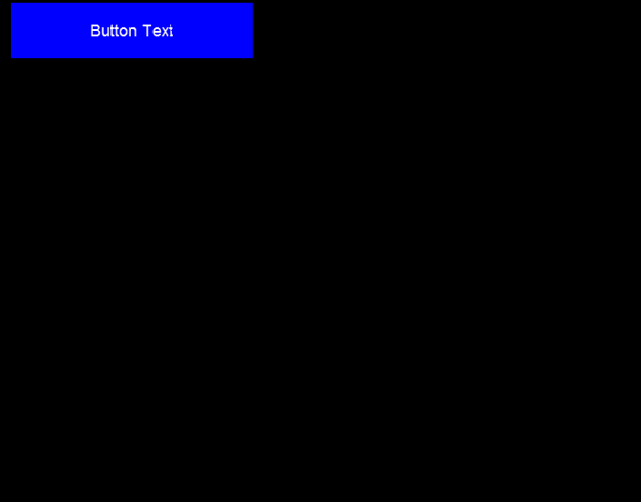

# 6952-2

### Introduction

Gum animations can be defined in the Gum tool or manually in code. This page covers the details of creating a Gum animation purely in code.

### Animations and Instructions

Animations are a convenient way to play, and stop instructions. Instructions are a FlatRedBall concept which encapsulate performing a particular action. For example, in instruction may set a variable, play a sound effect, or even create other instructions. The only requirements for creating an animation (which is of type GumAnimation ) are to define the instructions which will play when the animation executes and to define its length.

### Simple Animation Example

For this example we will create an animation which moves a component to three different positions. Animations can be defined in the component partial class itself (in which case this  might be used to reference the component) or in code that has access to the component (in which case the code references the component by its variable name). For this example, we'll reference the component by its variable name ButtonInstance. Assuming that ButtonInstance  is in scope, the following code could be used to define an animation:

```lang:c#
FlatRedBall.Gum.Animation.GumAnimation MoveAroundAnimation;

IEnumerable<Instruction> GetMoveInstructions(object target)
{
    yield return new DelegateInstruction(() => { ButtonInstance.X = 100; ButtonInstance.Y = 10; })
    {
        Target = target,
        TimeToExecute = TimeManager.CurrentTime + 0
    };

    yield return new DelegateInstruction(() => ButtonInstance.Y = 200)
    {
        Target = target,
        TimeToExecute = TimeManager.CurrentTime + 1
    };

    yield return new DelegateInstruction(() => ButtonInstance.X = 400)
    {
        Target = target,
        TimeToExecute = TimeManager.CurrentTime + 2
    };
}

void CustomInitialize()
{
    MoveAroundAnimation = new FlatRedBall.Gum.Animation.GumAnimation(5, GetMoveInstructions);

}

void CustomActivity(bool firstTimeCalled)
{
    if(InputManager.Keyboard.KeyPushed(Microsoft.Xna.Framework.Input.Keys.Space))
    {
        MoveAroundAnimation.Play();
    }

}
```

[](../../../media/2017-04-GumButtonAnim.gif)

#### GetMoveInstructions

The actions performed in the animation are defined in the GetMoveInstructions method, which returns an IEnumerable\<Instruction> . Each instruction defines the logic to perform and the time to perform it. First, we should note that the method returns the enumerable using yield return . While this isn't necessary, this approach can simplify your code. It's also important to note that the GetMoveInstructions  constructs and returns new instructions every time it is called, so that the time can be set appropriately, as is explained below. In this code example we are using the DelegateInstruction  class, which can be used to perform any action as specified in its constructor. Notice that the actions performed can be simple or can be more complex C#. The first instruction in the code above assigns two variables, so the action is wrapped in brackets, as shown in the following snippet:

```lang:c#
yield return new DelegateInstruction(() => { ButtonInstance.X = 100; ButtonInstance.Y = 10; })
```

Instructions in an animation do not execute immediately, so their time must be set relative to the current time, which is obtained through TimeManager.CurrentTime . For example, the following code for the second instruction sets its time to be one second later than the current time:

```lang:c#
    yield return new DelegateInstruction(() => ButtonInstance.Y = 200)
    {
        Target = target,
        TimeToExecute = TimeManager.CurrentTime + 1
    };
```

If the instructions are created once and reused, rather than created every time the GetMoveInstruction  method is called, then the same TimeToExecute  would be used. Creating new instructions allows for setting the TimeToExecute  relative to the current time.
