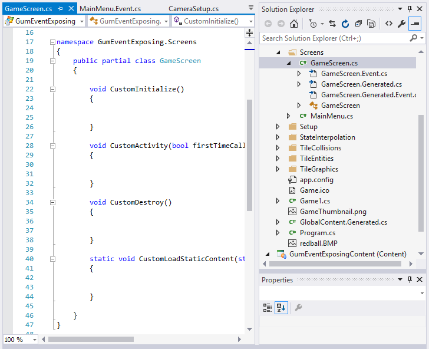
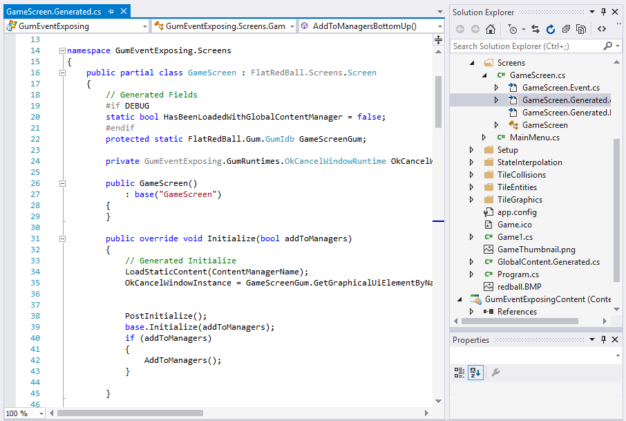
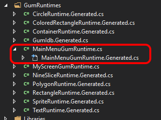

# 8-adding-code-to-gum-objects

### Introduction

Although Gum provides extensive layout control, many games require Gum components with custom logic. For example, a button may need to play a sound effect when clicked - logic which should be centralised in the button component code rather than added as events on every button instance. This tutorial shows how to use partial classes to add custom logic to a button. Although we use partial classes for the specific functionality of adding sound effects, partial classes can be used for any other logic.

### What is a Partial Class?

Partial classes, which use the partial keyword, allow the definition of a single class to be spread out across multiple files. Glue uses partial classes to separate custom code from generated code (so that generated code does not overwrite custom code). In fact, all screens and entities in a Glue project already use partial classes. You can see this by expanding any screen or entity in your project in Visual Studio. The following image shows a GameScreen's custom code:



The following image shows a GameScreen's generated code:



Similarly, your Visual Studio project will have two files for each Gum screen and component: One for generated code and one for custom code. For example, if you have been following this tutorial, you will have a

* MainMenuGumRuntime.cs
* MainMenuGumRuntime.Generated.cs



### Adding CustomInitialize

We can handle the Click event by modifying the ButtonRuntime code as follows:

```lang:c#
partial void CustomInitialize()
{
    this.Click += HandleClick;
}

private void HandleClick(IWindow window)
{

}
```

Now we can add code in our HandleClick method to perform any custom logic when the user clicks the button. This code will be executed on every instance of ButtonRuntime across our entire project.

### Troubleshooting

#### No defining declaration found for implementing declaration of partial method

This is usually caused by having a mismatched namespace in your partial compared to the partial of the generated code. [<- 7. States](tutorials-gum-states.md) -- [Back to Tutorials ->](../../documentation/tutorials.md)
