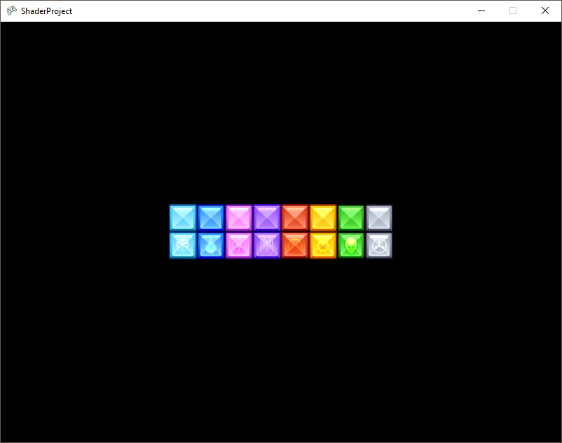

# flatredballxna-tutorials-custom-sprite-effects

### Introduction

[Sprite](../../../frb/docs/index.php) appearance can be modified through a number of properties including [Texture](../../../frb/docs/index.php), [ColorOperation](../../../frb/docs/index.php), and [BlendOperation](../../../frb/docs/index.php). Full rendering control can be achieved by using custom shaders, applied through an [IDrawableBatch](../../../documentation/api/flatredball/graphics/drawablebatch.md). This guide covers how to render a Sprite using a custom IDrawableBatch.

### &#x20;Adding files to Glue

Before writing any code, we'll add a few files to our project. This requires an existing Glue project with at least one Screen. To add a shader file:

1. Download this file: [Shader.fx](http://files.flatredball.com/content/Tutorials/Graphics/Shader.fx)
2. Add the file to your Glue screen

To add an image file:

1. Download this file: 
2. Add the file to your Glue screen

### Creating an IDrawableBatch

Next we'll create a [IDrawableBatch](../../../documentation/api/flatredball/graphics/drawablebatch.md) which will handle our rendering. To do this:

1. Add a new file to your project in Visual Studio
2. Name the file CustomShaderSprite
3. Replace your file with the following (you may need to change the namespace to match your project's namespace:

```lang:c#
using FlatRedBall;
using FlatRedBall.Graphics;
using Microsoft.Xna.Framework.Graphics;
using System;
using System.Collections.Generic;
using System.Linq;
using System.Text;
using System.Threading.Tasks;

namespace ShaderProject
{
    public class CustomShaderSprite : PositionedObject, IDrawableBatch
    {
        Sprite sprite;
        Effect effect;

        short[] indexData = new short[]
        {
            0,1,2,
            0,2,3
        };

        public Texture2D Texture { get; set; }

        public bool UpdateEveryFrame
        {
            get
            {
                return true;
            }
        }

        public CustomShaderSprite (Effect effect)
        {
            sprite = new Sprite();
            sprite.TextureScale = 1;
            this.effect = effect;
        }

        public void Destroy()
        {

        }

        public void Draw(Camera camera)
        {
            camera.SetDeviceViewAndProjection(effect, relativeToCamera: false);

            var textureParameter = effect.Parameters["CurrentTexture"];
            textureParameter.SetValue(Texture);

            effect.CurrentTechnique = effect.Techniques["Texture"];

            var graphicsDevice = FlatRedBallServices.GraphicsDevice;

            foreach(var pass in effect.CurrentTechnique.Passes)
            {
                pass.Apply();

                graphicsDevice.DrawUserIndexedPrimitives(
                     // Render a triangle:
                     PrimitiveType.TriangleList,
                     // The array of verts that we want to render
                     sprite.VerticesForDrawing,
                     // The offset, which is 0 since we want to start 
                     // at the beginning of the verts array
                     0,
                     4,
                     indexData,
                     0,
                     2);
            }
        }

        public void Update()
        {
            sprite.Position = this.Position;
            sprite.RotationMatrix = this.RotationMatrix;
            sprite.Texture = Texture;

            SpriteManager.ManualUpdate(sprite);
        }
    }
}
```

### Adding CustomShaderSprite to your Screen

To add an instance of CustomShaderSprite  to your screen, modify your Screen's code so its methods are as shown in the following code:

```lang:c#
public partial class GameScreen
{
    CustomShaderSprite customShaderSprite;

    void CustomInitialize()
    {
        customShaderSprite = new CustomShaderSprite(Shader);
        customShaderSprite.Texture = Match3Tiles;

        SpriteManager.AddDrawableBatch(customShaderSprite);
    }

    void CustomActivity(bool firstTimeCalled)
    {
    }

    void CustomDestroy()
    {
        SpriteManager.RemoveDrawableBatch(customShaderSprite);
    }

    static void CustomLoadStaticContent(string contentManagerName)
    {
    }

}
```

&#x20; Running the project will result in the following being shown on screen:



### Modifying Shader.fx

So far the project has created a simple sprite in a game screen which renders the same as a regular Sprite not using a custom shader. Of course, this sprite can be customized by changing the Shader.fx file. Making modifications to shaders is a large topic, and many articles can be found online. The following link can get you started: [http://gamedev.stackexchange.com/questions/773/what-are-some-good-resources-for-learning-hlsl](http://gamedev.stackexchange.com/questions/773/what-are-some-good-resources-for-learning-hlsl)
