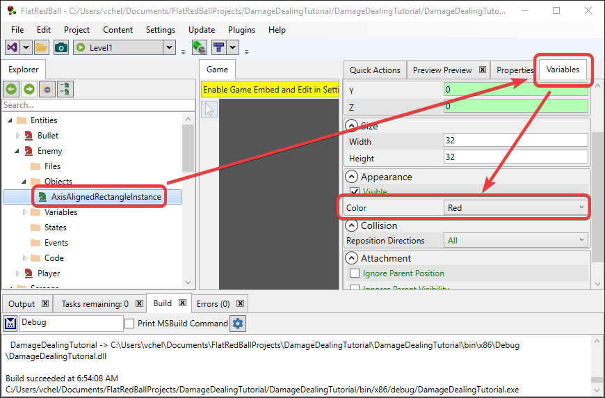

# Damage Events

### Introduction

Previous tutorials have discussed the automatic damage dealing logic provided by collision relationships. Full games often need to modify how much damage is dealt depending on a variety of factors such as element weaknesses. Similarly, games may need to respond to damage dealt such as by providing a visual indication of an entity taking damage. This tutorial shows how to assign events on IDamageable entities to modify damage dealt and to visually indicate that damage has been dealt.

### ReactToDamageDealt Event

Entities which implement the IDamageable interface are required to have an event named ReactToDamageDealt. This is automatically generated by the FlatRedBall Editor, so the event is available in custom code. This can be used to react to damage dealt. Keep in mind this event occurs after damage checks have been made. It will only be raised if the IDamageable entity has a different team index than the argument IDamageArea, and before the IDamageable is killed (if enough damage is dealt to kill the IDamageable). For example, we can make the enemy flash when it takes damage. First, we'll change the enemy's AxisAlignedRectangleInstance color to red in the FlatRedBall Editor.



Next, we can handle the event in code. In this case we'll use an async call to set the color to white temporarily, then set it back to red.

```
private void CustomInitialize()
{
    this.ReactToDamageReceived += HandleDamageReceived;
}

private async void HandleDamageReceived(decimal arg1, IDamageArea arg2)
{
    var colorBefore = AxisAlignedRectangleInstance.Color;
    AxisAlignedRectangleInstance.Color = Color.White;
    await TimeManager.DelaySeconds(.1);
    AxisAlignedRectangleInstance.Color = colorBefore;
}
```

Now the Enemy flashes white when taking damage. Note that to test this you may want to disable the enemy shooting logic added in the previous tutorial. Also, you may want to adjust the health of the enemy to take more hits.&#x20;

&#x20;

<figure><figcaption></figcaption></figure>

The purpose of ReactToDamageDealt is to react to damage visually, or to perform other game logic outside of typical IDamageable logic. Therefore, ReactToDamageDealt should not:

* Kill the damage receiver unless there are special circumstances
* Deal more damage to the damage receiver
* Destroy the IDamageArea (damage dealer) unless there are special circumstances

### ModifyDamageDealt Event

The ModifyDamageDealt event can be used to perform logic that can change how much damage an entity receives. For example, an enemy may be weak to a particular type of bullet such as an elemental bullet. For this example we will add a IsFireBullet property to the Bullet, and a IsIceEnemy property to the Enemy. Note that a real game may handle these variants through entity inheritance, but we will add properties through code to keep the tutorial shorter. Add the following code to Bullet.cs:

```
bool isFireBullet;
public bool IsFireElement
{
    get => isFireBullet;
    set
    {
        isFireBullet = value;
        if(value)
        {
            this.CircleInstance.Color = Color.Red;
        }
    }
}
```

Next, add the following code to Enemy.cs:

```
bool isIceEnemy;
public bool IsIceEnemy
{
    get => isIceEnemy;
    set
    {
        isIceEnemy = value;
        if(isIceEnemy) 
        {
            AxisAlignedRectangleInstance.Color = Color.Blue;
        }
    }
}
```

&#x20; Now we'll modify Player.cs to create fire bullets when pressing left Alt key:

```
private void CustomActivity()
{
    if(InputManager.Keyboard.KeyPushed(Microsoft.Xna.Framework.Input.Keys.Space))
    {
        var bullet = Factories.BulletFactory.CreateNew(this.Position);
        bullet.YVelocity = 200;
    }
    if (InputManager.Keyboard.KeyPushed(Microsoft.Xna.Framework.Input.Keys.LeftAlt))
    {
        var bullet = Factories.BulletFactory.CreateNew(this.Position);
        bullet.IsFireElement = true;
        bullet.YVelocity = 200;
    }
}
```

Next, we'll modify the code that creates Enemies in GameScreen.cs to create ice enemies on a right-click:

```
void CustomActivity(bool firstTimeCalled)
{
    var cursor = GuiManager.Cursor;

    if(cursor.PrimaryPush)
    {
        var cursorPosition = cursor.WorldPosition;
        Factories.EnemyFactory.CreateNew(cursorPosition.X, cursorPosition.Y);
    }
    if (cursor.SecondaryPush)
    {
        var cursorPosition = cursor.WorldPosition;
        var enemy = Factories.EnemyFactory.CreateNew(cursorPosition.X, cursorPosition.Y);
        enemy.IsIceEnemy = true;
    }
}
```

Now we can create fire enemies and ice bullets by right clicking the mouse and pressing the left Alt key, respectively.&#x20;

&#x20;

<figure><figcaption></figcaption></figure>

Now that we have two different types of enemies and two different types of bullets, we can write logic in the Enemy's ModifyDamageDealt  event in response to the elements: &#x20;

```
private void CustomInitialize()
{
    this.ReactToDamageReceived += HandleDamageReceived;
    this.ModifyDamageReceived += HandleModifyDamageReceived;
}

private decimal HandleModifyDamageReceived(decimal damage, IDamageArea arg2)
{
    var asBullet = arg2 as Bullet;

    if(asBullet != null && asBullet.IsFireElement && this.IsIceEnemy)
    {
        // for ice vs fire, deal double damage:
        damage *= 2;
    }

    return damage;
}
```

Now ice enemies die after 5 hits instead of 10 since each bullet will do an effective 20 points of damage.&#x20;

<figure><figcaption></figcaption></figure>

### Additional Events

This tutorial discusses two events:

* IDamageable.ReactToDamageReceived
* IDamageable.ModifyDamageReceived

The IDamageable and IDamageArea entities provide additional events which can be used to handle damage modification, reaction to taking damage, and death. This is the full list of events provided by each interface:

* IDamageable.ModifyDamageReceived - Allows an IDamageable to modify how much damage it takes
* IDamageable.ReactToDamageReceived - Allows an IDamageable to respond to taking damage
* IDamageable.Died - Allows an IDamageable to respond to dying, such as by playing a sound effect or creating particles
* IDamageArea.ModifyDamageDealt - Allows an IDamageArea to modify how much damage it deals
* IDamageArea.ReactToDamageDealt - Allows an IDamageArea to respond to dealing damage
* IDamageArea.KilledDamageable - Allows an IDamageArea to respond to killing an IDamageable
* IDamageArea.RemovedByCollision - Allows an IDamageArea to respond to being removed by collision

### Conclusion

This tutorial discusses how to handle events to modify damage and display visual feedback to the player when damage is dealt. The next tutorial covers the removal of IDamageAreas and how to implement damage over time.
