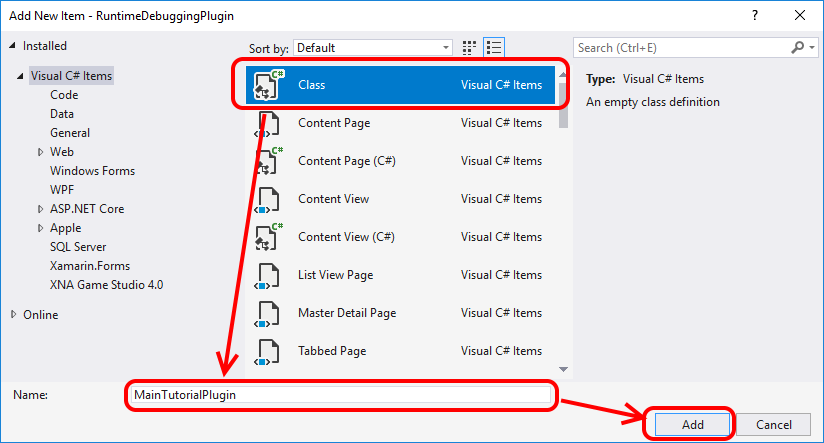
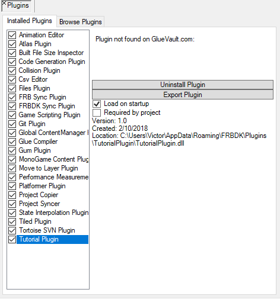

# Creating a Plugin Class

### Introduction

Every FlatRedBall plugin must have one class which implements PluginBase. This tutorial provides instructions for implementing the PluginBase  class in a plugin.

### Creating the MainTutorialPlugin Class

To add a main plugin class to your project:

1. Right-click on your project (mine is **TutorialPlugin**)
2. Select **Add** -> **New Item...**
3. Enter the name for your plugin (I will name mine **MainTutorialPlugin**)
4. Click the **Add** button



We will make the following modifications to our class:

```lang:c#
namespace TutorialPlugin
{
    [System.ComponentModel.Composition.Export(typeof(FlatRedBall.Glue.Plugins.PluginBase))]
    public class MainTutorialPlugin : FlatRedBall.Glue.Plugins.PluginBase
    {
        public override string FriendlyName => "Tutorial Plugin";

        public override void StartUp()
        {
            
        }
    }
}
```

So far our plugin doesn't do anything yet, but it does have all of the requirements to be an active plugin which can be detected by Glue.

### Copying the Plugin in Libraries

Now that our plugin is ready to be used in Glue, we can add it to be loaded by Glue. While developing plugins, we can add a post-build process to copy the compiled .dll to a location where Glue will find it. To do this:

1. Right-click on your plugin project and select **Properties**
2. Click the **Build Event** category
3.  Paste the following script in the **Post-build event command line:** section

    ```lang:c#
    IF NOT EXIST "$(SolutionDir)Glue\bin\Debug\Plugins\TutorialPlugin\" md "$(SolutionDir)Glue\bin\Debug\Plugins\TutorialPlugin\"
    copy "$(TargetDir)TutorialPlugin.dll" "$(SolutionDir)Glue\bin\Debug\Plugins\TutorialPlugin\TutorialPlugin.dll"
    ```

Notice that the script above assumes that the plugin is called TutorialPlugin - change the script as necessary if your plugin is named differently.

### Building the Plugin

To build the plugin, Build the plugin project explicitly - either by selecting the **Build** -> **Build Solution** menu item or right-clicking on the plugin project and selecting **Build** The last point deserves some explanation. Typically all projects are built when pressing F5 to run a project. However, when running Glue, Visual Studio will only automatically build all requirements for Glue. Our plugin is not required by Glue so Visual Studio will not automatically build it unless told to do so.

### Viewing the Plugin in Glue

Glue will automatically load any files in the **plugins** folder. Our plugin is set up to be loaded, so we can run Glue to see it. We can run Glue from Visual Studio to see our plugin in the plugin Window:

1. Run Glue from Visual Studio
2. Once Glue has finished loading, select the **Plugin** -> **Manage Plugins** menu item
3. Look for **Tutorial Plugin** in the list of plugins (or whatever **FriendlyName** your plugin is returning)



Note that the plugin is displaying its version of 1.0. Increasing the version number is a good way to verify that your changes are making their way into Glue if you're unsure. You can optionally specify the version number in your plugin, as shown in the following code:

```
// Add this as a property to your class. Change the version number to verify the build is working correctly
public override Version Version => new Version(1, 0);
```

&#x20;
