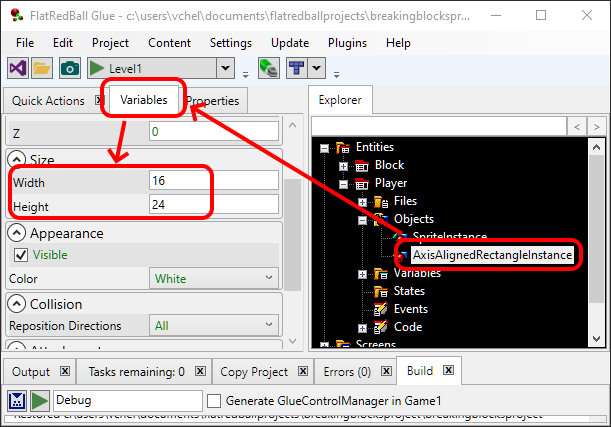
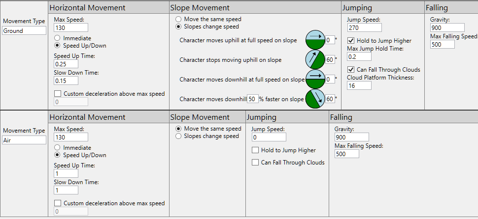
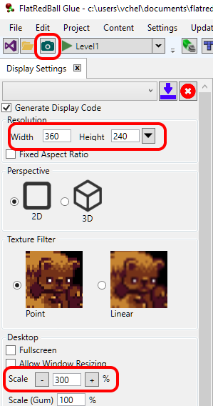
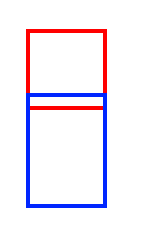
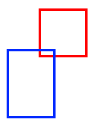
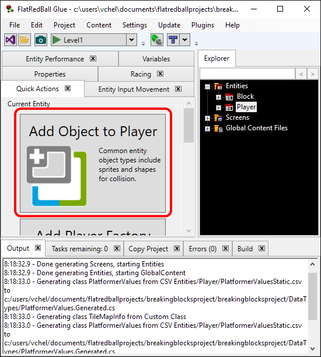
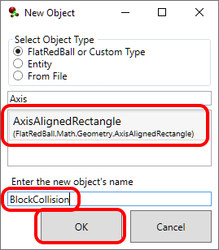
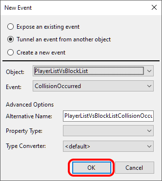
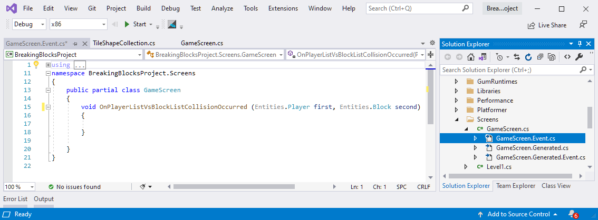

# Block Removal

### Introduction

Currently our game is fully playable as a platformer, but it is missing the feature we've been working towards on this whole tutorial - the removal of blocks on collision. Games which remove blocks based on collision are common. Some games, such as Mega Man and Metroid, remove blocks in response t being shot by a weapon. Super Mario Bros removes blocks in response to collision with the player. Specifically, if Mario has collected a power-up which makes him grow, then hitting a block from below destroys it.&#x20;

This tutorial will implement this type of destruction since it will give us the opportunity to perform more advanced collision logic.

### Adjusting the Player and Camera

Before we add logic to destroy Blocks, we will make some minor adjustments to the game to make it easier to control, and easier to see our player. First, we'll adjust the collision on the player.

1. Expand the Player Objects folder
2. Select the AxisAlignedRectangle
3. Change the Width to 16
4. Change the Height to 24



We'll also adjust the movement of the player so it's a little easier to control.

1. Click on the **Player** entity
2. Select the **Entity Input Movement** tab
3. Change the variables in this tab to the following values
   * Ground
     * Max Speed = 130
     * Jump Speed = 270
   * Air
     * Max Speed = 130



Next we'll zoom in the camera to make it easier to see the player.

1. Click the Camera icon in Glue
2. Change Resolution to 360x240
3. Change Scale to 300%



Now our character is easier to control and see.

### Breaking Blocks Conceptually

To help us understand the code that we will be writing, let's first look at block breaking implementation concepts. For the player to break the blocks, a number of things must happen:

1. The player must collide with the blocks. This may seem like an obvious requirement, but it's worth noting since it we will be writing code in the PlayerListVsBlockList collision relationship.
2. The player must hit the block from below.
3. Only one block can be destroyed at a time. Modern Super Mario Bros. games do support destroying multiple blocks at the same time, but the older games only support one at a time. We will follow the old approach.
4. Once a block is destroyed, the surrounding block RepositionDirections must be adjusted to prevent snagging.

Of the four concepts listed above, the one which requires the most attention is the third.

#### Breaking One Block at a  Time - Which Block Should Break?

To understand why breaking one block at a time adds complexity to our implementation, let's consider a few possible collision scenarios. The first scenario is the simplest - where the player collides with a single block as shown in the following image:



The player is represented by a blue rectangle and the block is represented by a red rectangle. In this case, the two overlap, and the player is hitting the block _from below_ so the block should break. Keep in mind that the player may not be exactly below the block. The block should break even if the player is slightly offset, as shown in the following image:



In the image above, the block would still break. Of course things get a little more complicated when we add multiple blocks. For example, consider the following image:


Which block should break in this situation? The player overlaps more of the block on the right than the block on the left, so breaking the block on the right seems best. Unfortunately, when we perform collision between entities and players, the block on the right may not ever collide with the player. CollisionRelationships perform collisions between one player/block pair at a time, and which pair is checked first depends on the order of blocks in the BlockList, which can change depending on partitioning. In other words, when using CollisionRelationships, we cannot depend on collision being performed in a particular order. With this in mind, it's possible that the left-most tile collides with the player first, which would result in the player being shifted down, as shown in the following image:


If the left block collides first and the player is pushed down as a result of the collision, the right block will not perform collision with the player. The events raised for collision will only be raised for the left block. As explained above, the block which actually collides with the player is arbitrary - it could be the left or it could be the right. This means that we cannot rely purely on the Player vs Block relationship to decide which block to destroy - at least, not if we plan on controlling which block is destroyed in such a situation.

#### Solving Block Breaking with Sub Collisions

We can solve this problem by adding a second collision object to the Player to help us decide which block to destroy. Glue supports objects with multiple collision objects. Consider the following image, where the Player object has two collision shapes - a blue rectangle for the body and a green rectangle for determining which rectangle to destroy.


Of course, it is possible that a block collision may occur even without the green rectangle colliding, as is the case in a single-block collision where the player is offset from the block.


This means that we can not rely completely on either the body (blue) or sub collision (green) to decide which block to destroy. Instead, we need to use both to decide which to destroy. The logic should be as follows:

* If the player collides with a block from below, then the player will destroy a block.
* First, check all blocks to see if any block collides with the sub collision (green rectangle). If so, destroy that block.
* Otherwise, if the sub collision (green rectangle) does not collide with any blocks, destroy the block that collided with the player body (blue)

This means that the sub collision is an optional collision. It should only be performed if the player body collides with the blocks from below. Therefore, we will be performing this collision manually in code rather than creating a collision relationship.

### Adding Player BlockCollision

As mentioned above, Glue supports objects with multiple collision shapes. To add a new shape to the Player:

1. Select the **Player** in Glue
2.  Select the **Quick Actions** tab and click the **Add Object to Player** button

    
3. Select the **AxisAlignedRectangle** object type
4. Enter the name **BlockCollision**
5.  Click **OK**

    
6. Select the newly-created BlockCollision
7. Set the following values:
   * Y = 12
   * Width = 1
   * Height = 5

Our player now has a small rectangle at the top. However, this rectangle is currently considered as part of the entire player. This is most evident when hitting blocks from below. Notice that the new sub-collision performs solid collision.

&#x20;&#x20;

<figure><figcaption></figcaption></figure>

We don't want this rectangle to perform solid collision - it should only be used in our code to check which block to break. To fix this, we can mark the BlockRectangle as being excluded from the default list of shapes used in collision. To do this:

1. Select the **BlockCollision** object under Player
2. Click the **Properties** tab
3.  Set the **IncludeInICollidable** to **false**

    

Now BlockCollision will still be part of the Player object but will not be considered in any CollisionRelationships (by default).

&#x20;

<figure><figcaption></figcaption></figure>

### Adding Block Destroying Logic

Now that we have a BlockCollision rectangle, we can perform the logic explained above. We'll treat each of the four steps separately.

#### 1. The Player Must Collide With the Blocks

We can handle Player vs Block collision by adding an event to this collision relationship:

1. Expand GameScreen **Objects** folder in Glue
2. Expand the **Collision Relationships** item
3. Select **PlayerListVsBlockList**
4. Select the **Collision** tab
5.  Click the **Add Event** button

    
6.  Click **OK** to accept the defaults

    

Glue has now added an event to the **GameScreen.Events.cs** file which is called whenever the Player collides with a Block.



#### The Player Must Hit the Block From Below

The OnPlayerListVsBlockListCollisionOccurred method is called whenever the player collides with a block from any side. This means that if the player is standing on a block, this function will be called every frame. We only want to destroy blocks if the player hits a block from below. Whenever a solid collision occurs, the objects being collided must be separated to prevent overlap. Since blocks cannot be moved when a collision occurs, the player must be moved. When hitting a block from below, the player must be moved downward (negative Y). We can check the player's **AxisAlignedRectangleInstance.LastMoveCollisionReposition.Y** value to see if the player was moved down due to the collision. If so, then the player hit the Block from below. Modify the **OnPlayerListVsBlockListCollisionOccurred** method as shown in the following code snippet:

```
void OnPlayerListVsBlockListCollisionOccurred (Entities.Player first, Entities.Block second)
{
    var wasPushedDown =
        first.AxisAlignedRectangleInstance.LastMoveCollisionReposition.Y < 0;
    if(wasPushedDown)
    {
        // The player hit the block from below
    }
}
```

#### Only One Block can be Destroyed at a Time

Now we can perform our destroy logic. As mentioned above, we will first check if the BlockCollision collides with any blocks. If so, we will destroy the block. Otherwise we will destroy the block that the body collided with. To do this, modify the **OnPlayerListVsBlockListCollisionOccurred** method as shown in the following code snippet:

```
void OnPlayerListVsBlockListCollisionOccurred (Entities.Player first, Entities.Block second) 
{
    var wasPushedDown =
        first.AxisAlignedRectangleInstance.LastMoveCollisionReposition.Y < 0;
    if(wasPushedDown)
    {
        bool hasDestroyedBlock = false;
        // First see if the player (first) BlockCollision has collided with any 
        // of the blocks
        for(int i = 0; i < BlockList.Count; i++)
        {
            if(BlockList[i].CollideAgainst(first.BlockCollision))
            {
                BlockList[i].Destroy();
                hasDestroyedBlock = true;
                break;
            }
        }
        // the BlockCollision doesn't collide with any of the blocks, so just destroy whichever block
        // we collided with
        if(!hasDestroyedBlock)
        {
            second.Destroy();
        }
    }
}
```

Now if we run the game, the Player can only destroy one Block at a time. If the Player collides with multiple Blocks, then the one which is directly above the Player will be destroyed. Of course, we there are some collision problems caused by the RepositionDirections not being adjusted properly. This is evident when trying to destroy the top row of blocks.  &#x20;

<figure><figcaption></figcaption></figure>

#### 4. Once a Block is Destroyed, Update RepositionDirections

The RepositionDirections are initially set when all of the Blocks are created, and will work properly until one of the Blocks is removed. Once a Block is removed, surrounding Blocks must have their RepositionDirections updated. To do this, we will remove the Block's collision from the CombinedShapeCollection before destroying the Block. Doing so will result in all adjacent collisions updating their RepositionDirections. To do this, modify the **OnPlayerListVsBlockListCollisionOccurred** method as shown in the following code snippet:

```
void OnPlayerListVsBlockListCollisionOccurred (Entities.Player first, Entities.Block second) 
{
    var wasPushedDown =
        first.AxisAlignedRectangleInstance.LastMoveCollisionReposition.Y < 0;
    if(wasPushedDown)
    {
        bool hasDestroyedBlock = false;
        // First see if the player (first) BlockCollision has collided with any 
        // of the blocks
        for(int i = 0; i < BlockList.Count; i++)
        {
            if(BlockList[i].CollideAgainst(first.BlockCollision))
            {
                // New code:
                CombinedShapeCollection.RemoveRectangle(BlockList[i].AxisAlignedRectangleInstance);

                BlockList[i].Destroy();
                hasDestroyedBlock = true;
                break;
            }
        }
        // the BlockCollision doesn't collide with any of the blocks, so just destroy whichever block
        // we collided with
        if(!hasDestroyedBlock)
        {
            // New code:
            CombinedShapeCollection.RemoveRectangle(second.AxisAlignedRectangleInstance);
            
            second.Destroy();
        }
    }
}
```

Notice that the rectangle is removed **before** the Block is destroyed. Also, notice that the RemoveRectangle method is called in two spots since we destroy blocks in two spots in the code above. Now the RepositionDirections are updated properly and the player will be able to collide with the blocks properly even after blocks are destroyed.

&#x20;

<figure><figcaption></figcaption></figure>

### Conclusion

If you've made it this far, congratulations! You have worked through a complex collision example in FlatRedBall. Now you should be able to add blocks freely in Tiled and the game will collide properly.   &#x20;
