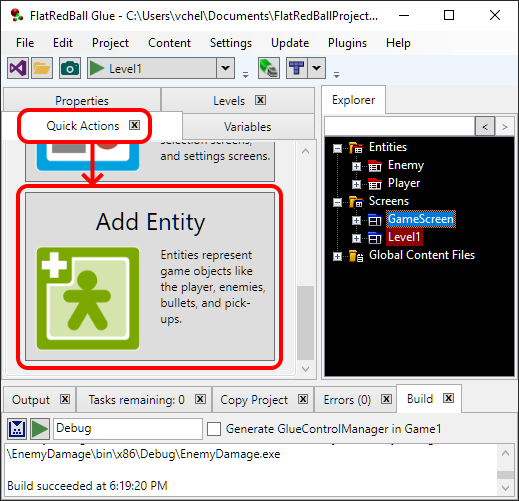
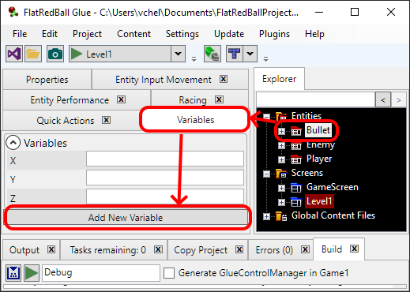
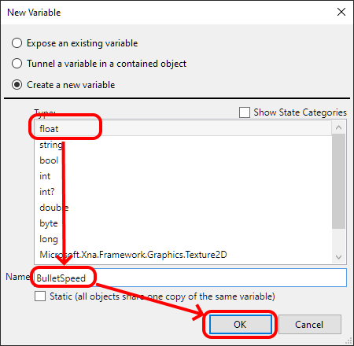
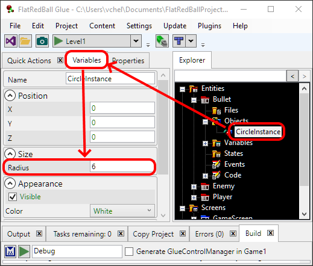
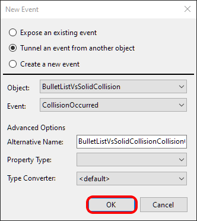

# Shooting Bullets

### Introduction

This tutorial adds a Bullet entity which the player can shoot. The Bullet entity has the following characteristics:

* It will be visually represented by a circle
* It moves left or right depending on which way the Player is facing when shooting
* It will be destroyed when colliding with the SolidCollision
* It will be destroyed when colliding with the Enemy

### Creating Bullet Entity

To create a Bullet:

1. Click the **Quick Actions** tab
2.  Click the **Add Entity** button

    
3. Enter the name **Bullet**
4. Click the **Circle** checkbox under **Collisions**
5.  Leave all of the rest of the values default and click **OK**

    

When a Bullet is created, it will move either left or right. We need to control the speed of the bullet. We will create a variable which we'll use in our code later:

1. Select the **Bullet** entity
2. Click on the **Variables** tab
3.  Click the **Add New Variable** button

    
4. Verify that **float** type is selected
5. Enter the name **BulletSpeed**
6.  Click **OK**

    
7.  Enter a value of **300** for **BulletSpeed**

    

We will also want to change the radius of the Bullet's CircleInstance:

1. Expand the **Bullet Objects** folder
2. Select **CircleInstance**
3. Click the **Variables** tab
4. Change **Radius** to **6**



### Creating a Bullet in Player

The Bullet creation logic will be added to the Player entity. We need to detect if the shoot button has been pressed. If so, we'll create a new bullet and have it move in the direction that the player is facing. To do this, open **Player.cs** in Visual Studio and modify the code as shown in the following snippet:

```
public partial class Player
{
    IPressableInput shootingInput;

    private void CustomInitialize()
    {
    }

    partial void CustomInitializePlatformerInput()
    {
        if(InputDevice is Keyboard keyboard)
        {
            shootingInput = keyboard.GetKey(Microsoft.Xna.Framework.Input.Keys.RightAlt);
        }
        else if(InputDevice is Xbox360GamePad gamepad)
        {
            shootingInput = gamepad.GetButton(Xbox360GamePad.Button.X);
        }
    }

    private void CustomActivity()
    {
        if(shootingInput.WasJustPressed)
        {
            var newBullet = Factories.BulletFactory.CreateNew(this.X, this.Y);

            if(DirectionFacing == HorizontalDirection.Right)
            {
                newBullet.XVelocity = newBullet.BulletSpeed;
            }
            else
            {
                newBullet.XVelocity = -newBullet.BulletSpeed;
            }
        }
    }

    private void CustomDestroy()
    {


    }

    private static void CustomLoadStaticContent(string contentManagerName)
    {


    }
}
```

&#x20;

#### IPressableInput

The first line of code in the Player class defines an IPressableInput. This is an object which can reference any pressable input hardware such as a keyboard key or an Xbox360GamePad button. We create this IPressableInput so that we can write code which will work regardless of input device. For more information on IPressableInput, see the [IPressableInput page](../../../api/flatredball/input/ipressableinput.md).

#### CustomInitializePlatformerInput

Whenever the input device is set on a platformer entity, the **CustomInitializePlatformerInput** method is called. Since our entity has custom input for shooting, we add the **CustomInitializePlatformerInput** where we assign **shootingInput** according to our **InputDevice** type. In this case we assign shooting to the right ALT key if using a keyboard and the X button if using an Xbox360GamePad. Any re-assignment of input should be done in **CustomInitializePlatformerInput** rather than **CustomInitialize**. This is because the order in which code is executed. When considering input, assignment, the following is performed:

1. CustomInitialize
2. InputDevice is assigned (can be assigned in generated code or custom code)
3. CustomInitializePlatformerInput which is called whenever the input device is assigned.

CustomInitialize always runs before an InputDevice is assigned. We want our shootingInput-assigning code to run after the InputDevice is assigned, so we should put it in **CustomInitializePlatformerInput.**

### shootingInput.WasJustPressed

Finally, we check our shootingInput.WasJustPressed to see if the user just pushed the input. If so, we create a bullet and set its XVelocity according to the direction that the Player is facing. If we run our game now, we can shoot bullets in the direction we're facing.&#x20;

<figure><figcaption></figcaption></figure>

### Destroying Bullets

Currently, our bullets can move through walls and enemies. First we'll add collision between our GameScreen BulletList and SolidCollision:

1. Expand the **GameScreen** **Objects** folder
2.  Drag **BulletList** onto **SolidCollision** to create a new collision relationship&#x20;

    <figure><figcaption></figcaption></figure>
3. Select the new **BulletListVsSolidCollision** relationship
4. Click the **Collision** tab
5.  Click the **Add Event** button

    
6.  Click **OK** to accept the defaults

    

Now we can destroy the bullet whenever the event occurs:

1. Open the project in Visual Studio
2. Go to **GameScreen.Event.cs**
3. Find the **BulletListVsSolidCollisionCollisionOccurred** method
4. Modify the code as shown in the following snippet:

&#x20;

```
void OnBulletListVsSolidCollisionCollisionOccurred (Entities.Bullet first, FlatRedBall.TileCollisions.TileShapeCollection second)
{
    first.Destroy();    
}
```

Now we can shoot bullets and they will get destroyed when they hit the wall.  &#x20;

<figure><figcaption></figcaption></figure>

### Conclusion

We end this tutorial with the ability to shoot bullets and destroy them when they hit the wall. The next tutorial will implement the ability to damage and destroy enemies.
