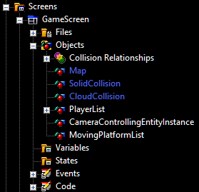

# Moving Platforms

### Introduction

This walkthrough covers concepts related to creating moving platforms. Moving platforms can be used to transport a player vertically or horizontally, and can provide challenge and variety to a platformer level. When walking on a moving platform, the platformer Player is able to move faster and jump further.



This sample can be downloaded from GitHub: [https://github.com/vchelaru/FlatRedBall/tree/NetStandard/Samples/Platformer/MovingPlatformDemo](https://github.com/vchelaru/FlatRedBall/tree/NetStandard/Samples/Platformer/MovingPlatformDemo) &#x20;

<figure><figcaption></figcaption></figure>

This walkthrough refers to MovingPlatfomDemo as _this demo_ and _the demo_.

### Main Concepts

This walkthrough covers a number of concepts related to moving platforms:

* Moving platforms horizontally using acceleration and await calls
* Performing platformer collision between the PlayerList and MovingPlatformList

### Moving Platforms Horizontally

The MovingPlatform entity is used in this demo. It moves itself by setting its XAcceleration value and changing this value on a timer controlled by async calls. This logic is started in MovingPlatform.cs and continues to loop until the MovingPlatform is destroyed. &#x20;

```
public partial class MovingPlatform
{
    bool isDestroyed = false;

    private void CustomInitialize()
    {
        StartMoving();
    }

    private async void StartMoving()
    {
        async Task AccelerateFor(float acceleration, float seconds)
        {
            XAcceleration = acceleration;
            await TimeManager.DelaySeconds(seconds);
        }

        while(!isDestroyed)
        {
            await AccelerateFor(30, 1);
            await AccelerateFor(0, 2);
            await AccelerateFor(-30, 2);
            await AccelerateFor(0, 2);
            await AccelerateFor(30, 1);
        }
    }

    private void CustomActivity()
    {

    }

    private void CustomDestroy()
    {
        isDestroyed = true;
    }
```

Notice that the StartMoving function is an async method, and it uses the async functionality supported in FlatRedBall to simplify the looping logic for moving. The logic in StartMoving performs the following:

* Set XAcceleration to 30 for 1 second - the platform starts stationary and ends moving 30 units/second to the right
* Set XAcceleration to 0 for 2 seconds - the platform will be moving to the right at a constant speed
* Set XAcceleration to -30 for 2 seconds - the platform will reverse direction
* Set XAcceleration to 0 for 2 seconds - the platform will be moving to the left at a constant speed
* Set XAcceleration t0 30 for 1 second - this will result in the platform standing still, but its acceleration will continue on the next loop

This code loops continually until the entity is destroyed. The entity sets this value to true in CustomDestroy which will result in the StartMoving loop eventually ending. Notice that this code uses acceleration values, which ultimately change the MovingPlatform velocity values. Moving platforms must use velocity to move as opposed to directly setting their position values to have an impact on the movement of the player.

### MovingPlatform Collision

The GameScreen contains a list of Players and a list of MovingPlatforms.



The PlayerList collides against the MovingPlatformList using **Platformer Solid Collision** physics


Note that usually platformer entities like Player collide against TileShapeCollections using Platformer Solid Collision, but this can also be used when colliding against another entity list.

### Conclusion

This walkthrough showed how to move a moving platform using acceleration and how to collide the player entity against the moving platform using platformer physics.
