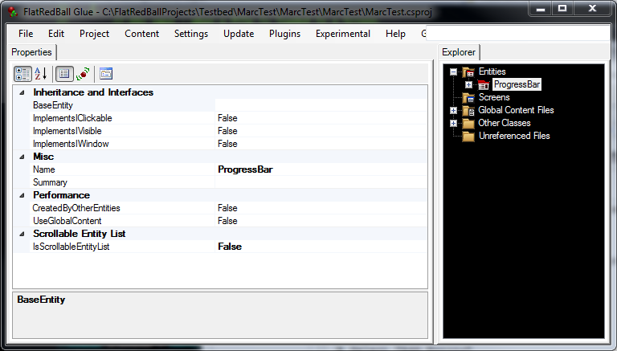
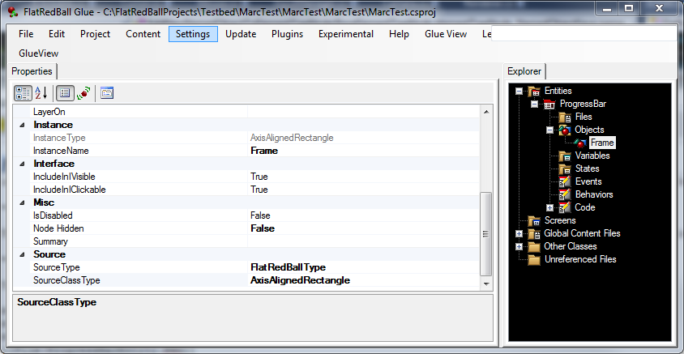
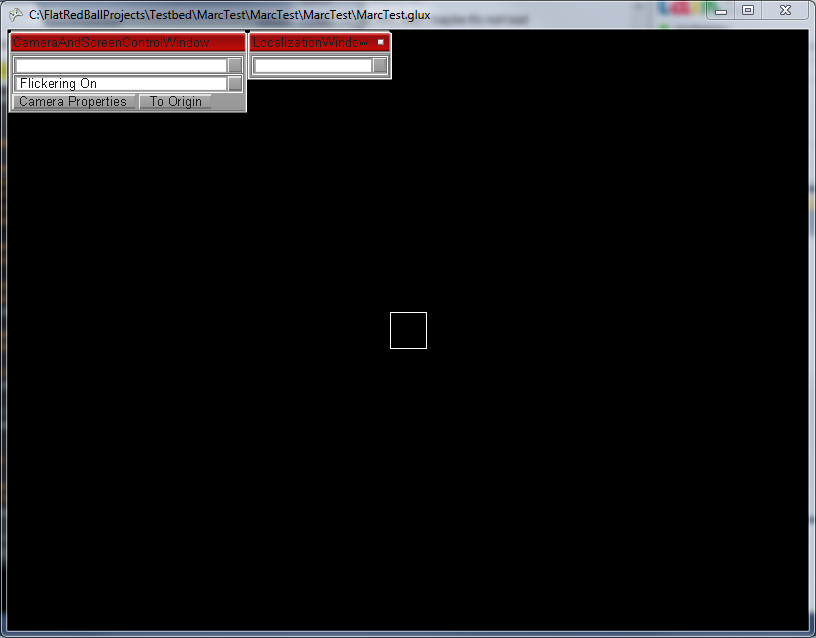
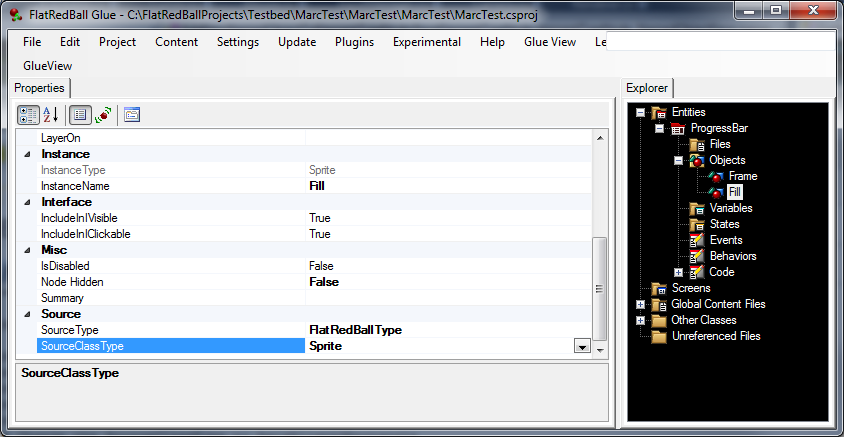
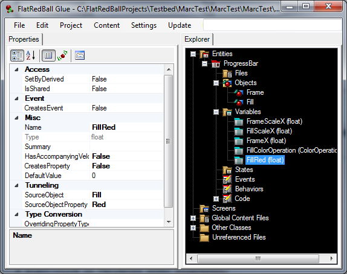
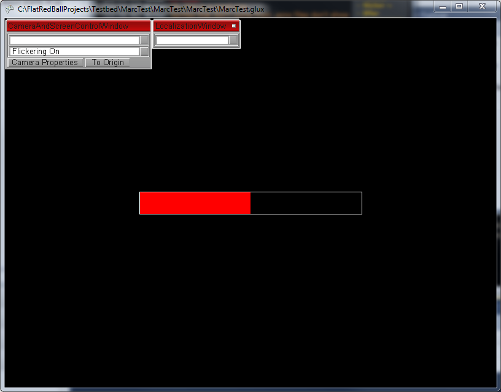
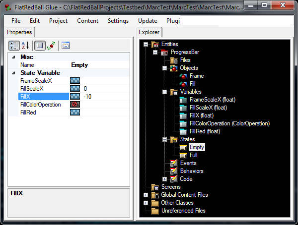
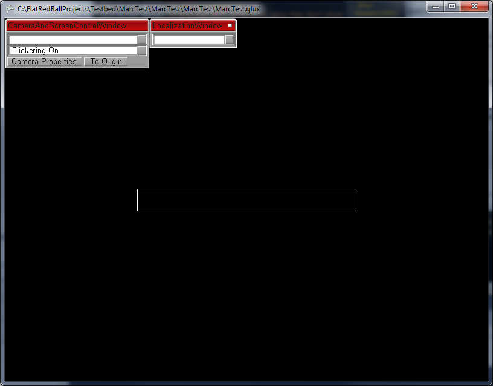
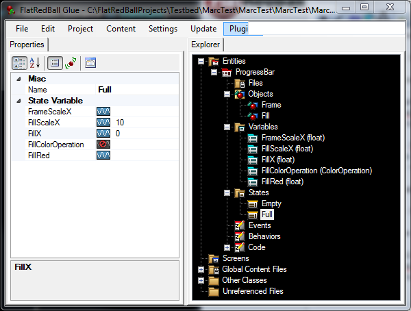

# glue-reference-states-interpolatebetween

### Introduction

The InterpolateBetween method allows you to combine two states to create an in-between state. For example, consider a ProgressBar Entity that shows the player's progress on a quest. The progress percentage may be any number, and creating one state for each number (1%, 2%, 3%, 4%, etc) is tedious and impractical. The InterpolateBetween can simplify this by allowing two states to be combined (such as a EmptyState and FullState).

See [this page](../frb/docs/index.php) to discuss the difference between InterpolateToState and InterpolateBetween.

### Method Signature

The InterpolateBetween method signature is as follows:

```
// InterpolateBetween exists for each state category, so there is no specific type this method takes for
// the first two arguments.
void InterpolateBetween(<StateType> firstState, <StateType> secondState, float interpolationValue)
```

### Understanding InterpolationValue

The interpolation value is a float value which determines how much of each state should be applied. Usually this value is between 0 and 1, although it doesn't have to be. Values outside of the 0 to 1 range may be used, but we'll consider the most common range for this discussion.

**The most important thing to keep in mind is interpolation works only on numerical values**. For example, interpolating the X variable is possible, while it is impossible to interpolate the Visible variable (which is a bool) or the DisplayText variable (which is a string).

**The second most important thing to keep in mind is that the closer the value is to 0, the more of the first state will apply. The closer the value is to 1, the more of the second state will apply.** Therefore passing 0 as the value is the same as simply setting the state to the first state using the CurrentState property. Passing 1 is the same as simply setting the state to the second state.

For this example, consider an Entity with two states: Large and Small. We'll assume that the states have the following

**Small**

* ScaleX = 16
* ScaleY = 8

**Large**

* ScaleX = 64
* ScaleY = 32

Let's look at some simple examples:

```
this.InterpolateBetween(VariableState.Small, VariableState.Large, 0);
```

This example is similar to saying "Interpolate 0% of the way from the Small state to the Large state". If we were to draw this on a graph, it might be something like this:

```
InterpolationValue is 0
0                                   1
v                                   
|-----------------------------------|
Small                           Large
```

In this case, the above code is identical to simply setting the CurrentState to VariableState.Small.

Similarly, the following code:

```
this.InterpolateBetween(VariableState.Small, VariableState.Large, 1);
```

is the same as setting the CurrentState to VariableState.Large.

But what happens when a value other than 0 or 1 is used? Let's look at the value of .5:

```
this.InterpolateBetween(VariableState.Small, VariableState.Large, 0.5f);

InterpolationValue is .5 (in the middle)
0                                   1
                   v                  
|-----------------------------------|
Small                           Large
```

In this example, half of the Small and half of the Large states will be used. In other words, the ScaleX and ScaleY values will be equally set from the Small and Large states. This is the same as taking a "average" of the two values. The average ScaleX is 40 and the average ScaleY is 20.

Let's look at the math behind that. An average is a special type of interpolation which can be simplified to as follows:

```
average = (firstValue + secondValue) / 2
```

In the case of ScaleX:

```
40 = (16 + 64) / 2
```

Another way to express this (which will be helpful in the following discussion) is:

```
average = .5 * (firstValue + secondValue)
```

Which can be expanded to:

```
average = .5 * firstValue + .5 * secondValue
```

While this may seem pointless, it will help us understand the math behind interpolation in a more general sense.

Another way to think about the value above is to think of it as a combination of the two states, with 50% Small and 50% Large.

So let's look at the last (and most complicated example):

```
 this.InterpolateBetween(VariableState.Small, VariableState.Large, 0.3f);
```

This is similar to our example above, except that we aren't using a 50/50 split. The following graph shows what the split might look like visually:

```
0                                   1
            v                  
|-----------------------------------|
Small                           Large
```

Notice that the there is "more Small" than "Large" in this situation. Specifically, there is 70% Small and 30% Large. Therefore, the formula is:

```
averageValue = .7 * firstValue + .3 * secondValue
```

Or to use ScaleX as an exmaple:

```
30.4 = .7 * 16 + .3 * 64
```

Notice that the closer the value is to 0 (the closer it is to Small) then the closer the ScaleX value is to 16. The closer the value is to 1 (the closer it is to Large) then the closer the ScaleX value is to 64.

### Interpolation of non-numeric values

As mentioned above, InterpolateBetween only applies to values which can interpolate (such as floats and ints). Common types which cannot interpolate are:

* bool (such as Visible)
* Texture2D (such as a Sprite's Texture)
* string (such as a Text's DisplayText)

However, these values will be set to the value of either of the states if the interpolation value is less than or equal to 0, or greater than or equal to 1.

### Example

This example shows how to create a simple progress bar and how to fill it according to a percentage complete (between 0 and 100).

#### Creating a ProgressBar Entity

To create a ProgressBar Entity:

1. Right-click on the Entities item
2. Select "Add Entity"
3. Name the Entity "ProgressBar"



#### Adding the Frame object

Next we'll create the objects in the ProgressBar:

1. Expand the ProgressBar Entity
2. Right-click on the Objects item
3. Select "Add Object"
4. Name the object "Frame"
5. Change the SourceType to "FlatRedBall Type"
6. Change the SourceClassType to AxisAlignedRectangle

In GlueView:

#### Adding the Fill object

To create the Fill object:

1. Right-click on the Objects item under ProgressBar
2. Select "Add Object"
3. Name the object "Fill"
4. Change the SourceType to "FlatRedBal Type"
5. Change the SourceClassType to Sprite



#### Tunneling into Variables

Next we'll tunnel in to the variables of our objects. To do this:

1. Right-click on Variables under ProgressBar
2. Select "Add Variable"
3. Select to tunnel a variable
4. Select the "Frame" object and the "ScaleX" variable
5. Repeat the above steps to tunnel into the "Fill" object's "ScaleX" variable
6. Repeat the above steps to tunnel into the "Fill" object's "X" variable
7. Repeat the above steps to tunnel into the "Fill" object's "ColorOperation" variable
8. Repeat the above steps to tunnel into the "Fill" object's "Red" variable



### Setting initial values

Before creating the states we'll set some default values for the variables:

1. Select and set the FrameScaleX variable to 10
2. Select and set the FillScaleX variable to 5
3. Select and set the FillX variable to -5
4. Select and set the FillColorOperation variable to Color
5. Select and set the FillRed variable to 1



#### Creating the states

Now that all variables are created we'll make the first state:

1. Right-click on the States item
2. Select "Add State"
3. Enter the name "Empty"
4. Repeat the above steps and create a State called "Full"

#### Defining the Empty State

First we'll define the "Empty" state:

1. Select the "Empty" state under States
2. Set the FillScaleX to 0
3. Set the FillX to -10 (this places it on the left side of the Frame)

Notice that both FillScaleX and FillX have the wavy blue icon - this indicates that the values can interpolate. In other words, when we interpolate between the Full and Empty states any variables that have this icon will combine depending on the value we pass to InterpolateBetween.

 

#### Defining the Full State

Next we'll define the "Full" state:

1. Select the "Full" state under States
2. Set the FillScaleX to 10
3. Set the FillX to 0

 

#### Creating a Screen

To view our Entity in our game we need to create a Screen to hold an instance of the ProgressBar:

1. Right-click on Screens
2. Select "Add Screen"
3. Enter the name "ProgressScreen"
4. Drag+drop the ProgressBar Entity into the ProgressScreen's Objects item

#### Adding the Percentage property to ProgressBar in Code

Finally we'll use InterpolateBetween in code. To do this:

1. Select Project->"View in Visual Studio"
2. Navigate to the ProgressBar.cs (in the Entities folder)
3. Add the following code to ProgressBar.cs:

&#x20;

```
float mPercentage;
float Percentage
{
    get { return mPercentage; }
    set
    {
        mPercentage = value;
        float ratio = mPercentage / 100;
        InterpolateBetween(VariableState.Empty, VariableState.Full, ratio);
    }
}
```

#### Changing the Percentage at runtime

Finally let's add some code to change the percentage at runtime. Modify the ProgressBar's CustomActivity as follows:

```
if (InputManager.Keyboard.KeyDown(Keys.Right))
{
    Percentage += 20 * TimeManager.SecondDifference;
}
if (InputManager.Keyboard.KeyDown(Keys.Left))
{
    Percentage -= 20 * TimeManager.SecondDifference;
}
```

If you run the game you can change the progress bar by holding down the left and right arrow keys.
