# spriteeditor-tutorials-sprite-grids

### Introduction

SpriteGrids are objects which allow you to quickly define groups of tiled Sprites. SpriteGrids are often used as tile maps, but can also be used in other situations to create Sprites, such as platformer games. The [TileEditor](../frb/docs/index.php) makes extensive use of SpriteGrids, but the SpriteEditor also supports viewing and editing them.

### Creating a SpriteGrid

To create a new SpriteGrid in the SpriteEditor:

1. Select Add->SpriteGrid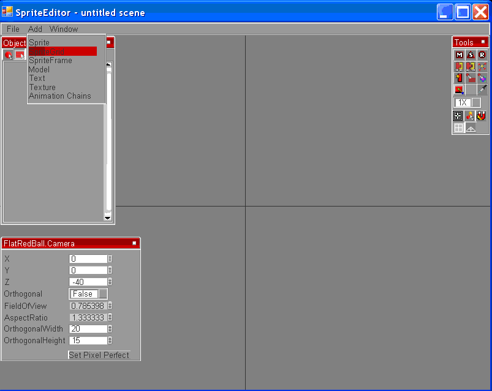
2. Navigate to select a graphical image to use in your SpriteGrid. This example will use a [checkerboard pattern which you can download here](../frb/docs/images/8/88/CheckerTile.png).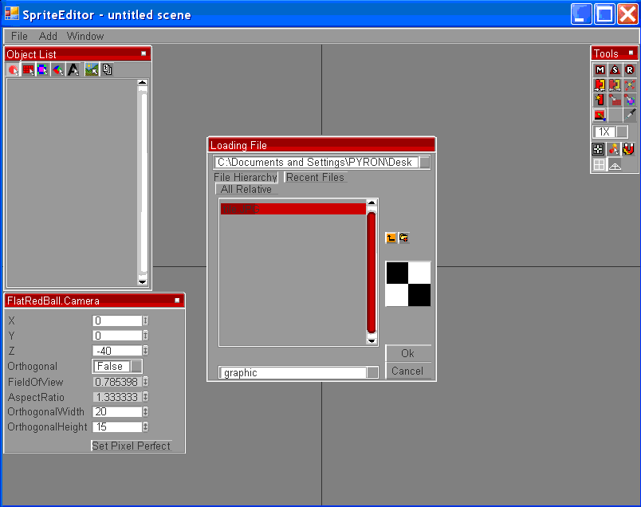
3. Once you select your image, you should see a pop-up window displaying options for the SpriteGrid. Leave the values to default and press the OK button.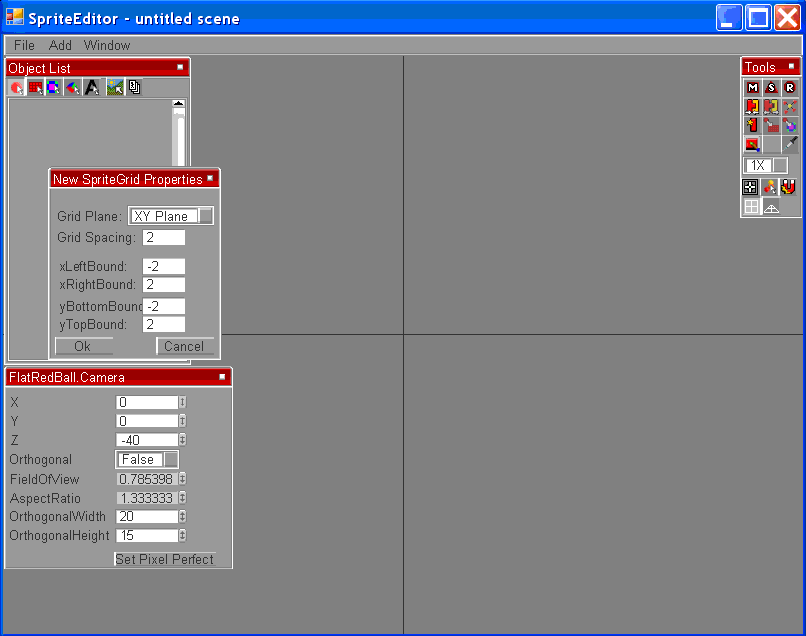
4. Now you should see your SpriteGrid in the SpriteEditor

### Modifying a SpriteGrid

There are a number of ways to modify a SpriteGrid:

1. Move your mouse over the yellow rectangles, then click+drag to resize the SpriteGrid
2. Select the "Move" tool
3. Click+drag any Sprite in the SpriteGrid to move the entire SpriteGrid. Be careful, if you grab the editor handles (the red, green, or blue handles), you will move an individual Sprite instead of the entire SpriteGrid.
4. You can also right-click+drag to move the SpriteGrid along the Z axis (closer and further from the camera). This is useful if you want to make one SpriteGrid draw in front of another.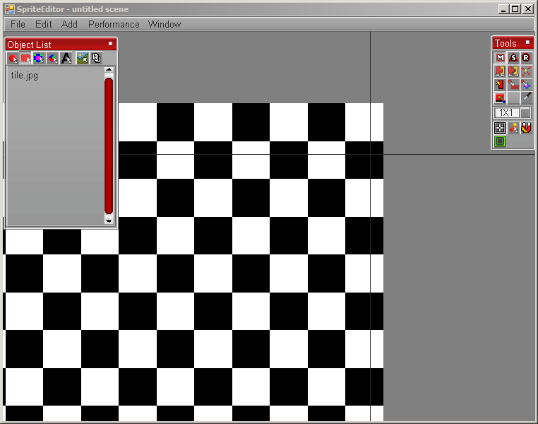

### Modifying Sprite Properties

So far we've covered adjusting the entire SpriteGrid as a whole. This section will show you how you can manipulate an individual Sprite and have it apply to the entire SpriteGrid.

1. Select your SpriteGrid
2. Whenever a SpriteGrid is selected, you will also see one individual Sprite selected in the SpriteGrid. This means you will have the editor handles available for one Sprite, as well as the properties window for that Sprite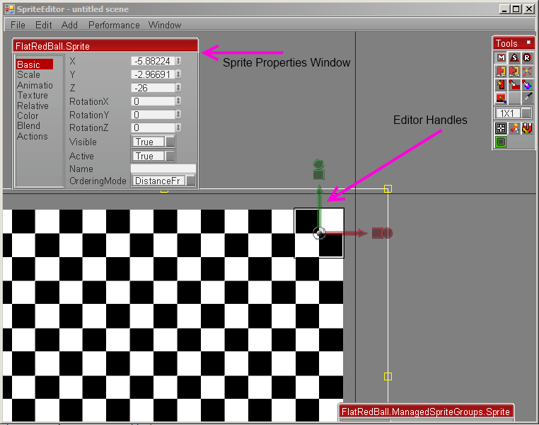
3. You can apply values to a Sprite in a SpriteGrid then have those values applied to the entire SpriteGrid. For example, we'll move the SpriteGrid back to Z = 0. To do this, enter 0 for the Z value on the selected Sprite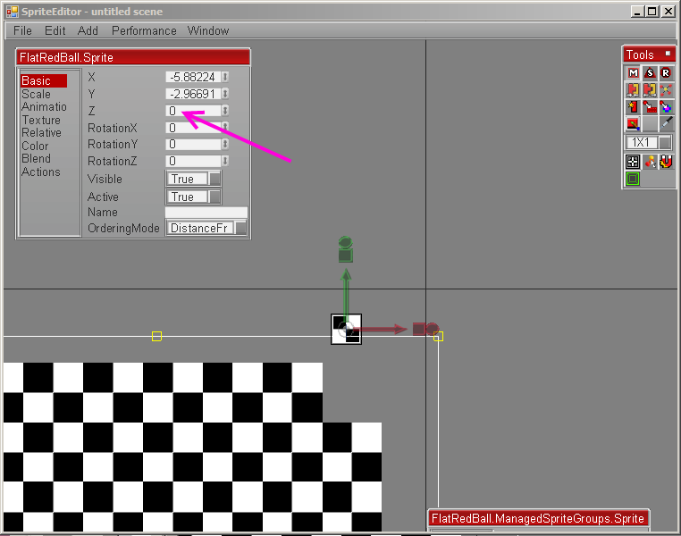
4. Once you change the Z, the Sprite will move back to Z = 0. To apply the changes to the entire SpriteGrid, simply de-select the SpriteGrid by clicking on an empty space in the SpriteEditor, or by selecting another object if there is no space to click. You will be asked if you want to apply the changes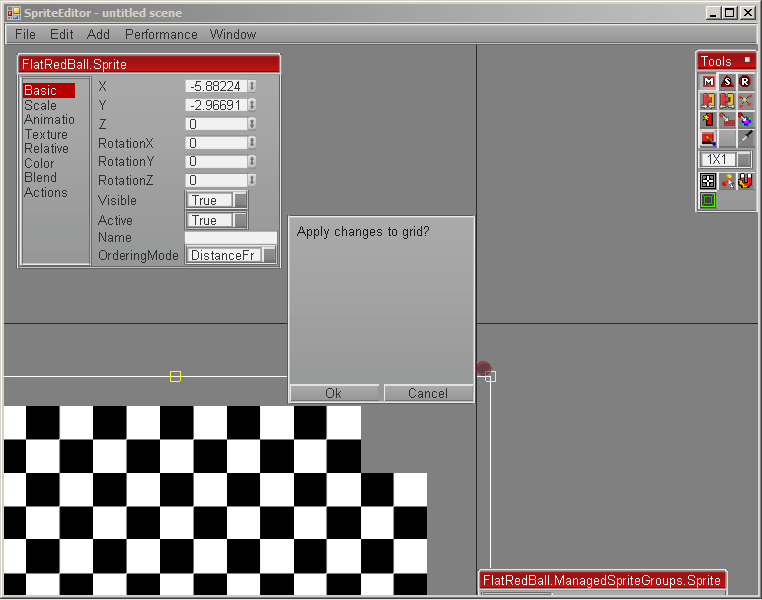
5. Click "OK" and the entire SpriteGrid will change its Z to be 0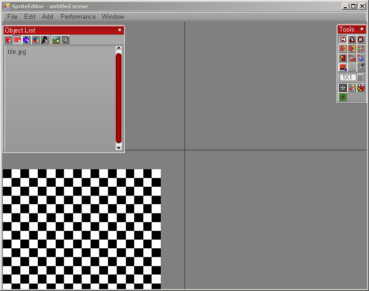

### Painting SpriteGrids (version 1)

Now that we have this SpriteGrid, why don't we paint it with a different texture? First, click on one of the tiles. This brings up the Sprite Property Window.

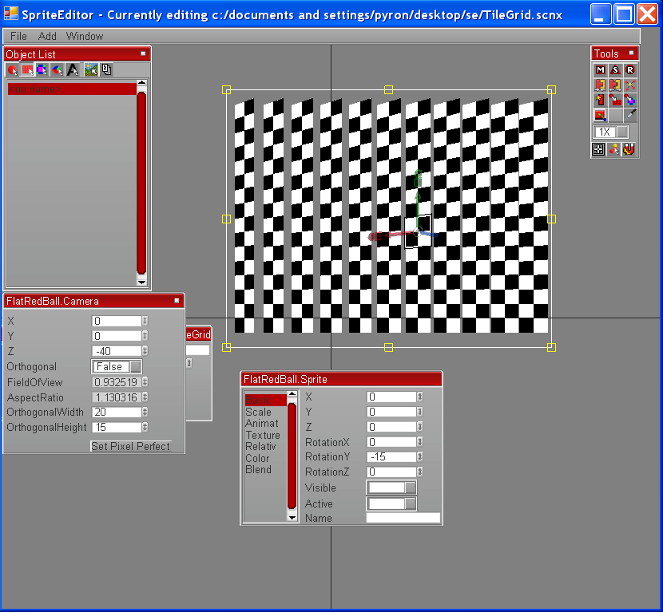

Navigate to the texture tab of the Sprite Property Window

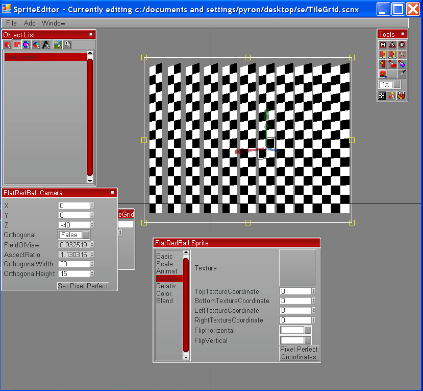

Click on the large square next to the Texture label to bring up the pop-up window to load a texture. Let's select the RedTile (right-click here to download the [tile](../frb/docs/images/8/8c/RedTile.JPG))

This will paint the particular Sprite that new Texture. Repeat this process for as many Sprites as you want

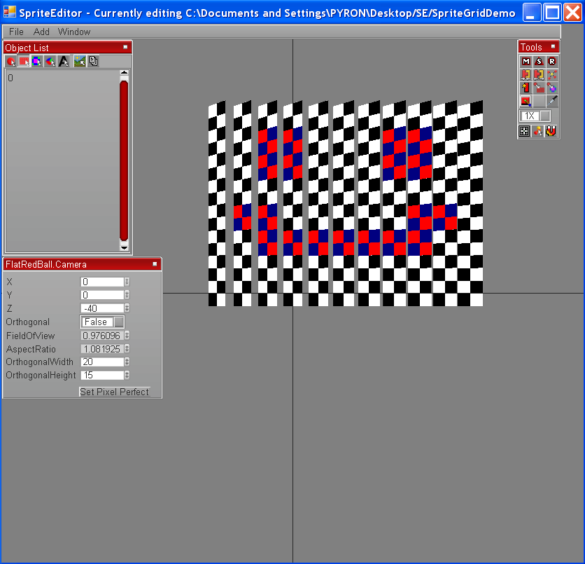

### Painting SpriteGrids (version 2)

Alternatively, a slightly easier way to paint SpriteGrids is to use the Painting tool. Starting with our original SpriteGrid, click on the Paint tool (4th row, left icon).

Next, click on the Texture window (4th row, middle icon). It will bring up a file selection window. Let's use the GreenTile (right-click here to download the [tile](../frb/docs/images/8/8e/GreenTile.JPG))

In both the Texture window and the Texture pop-up window, a preview of the texture (the GreenTile) will be visible.

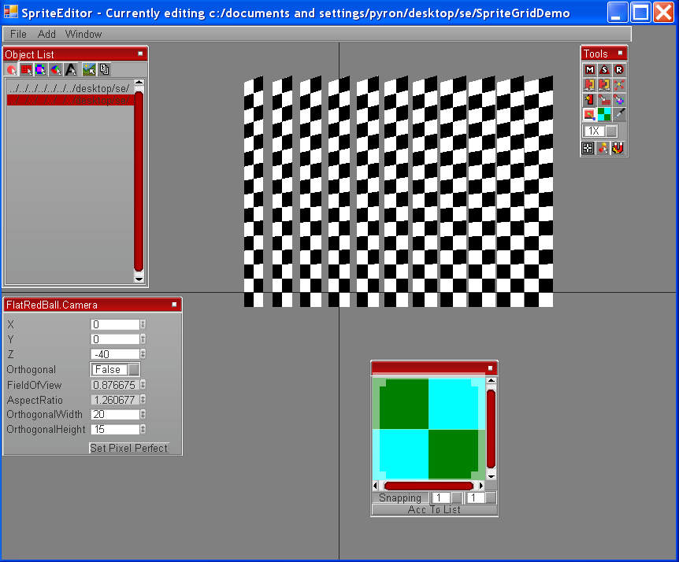

Now, with the Paint tool selected, click and drag the mouse across the selected SpriteGrid to paint the Sprites with the desired Texture.

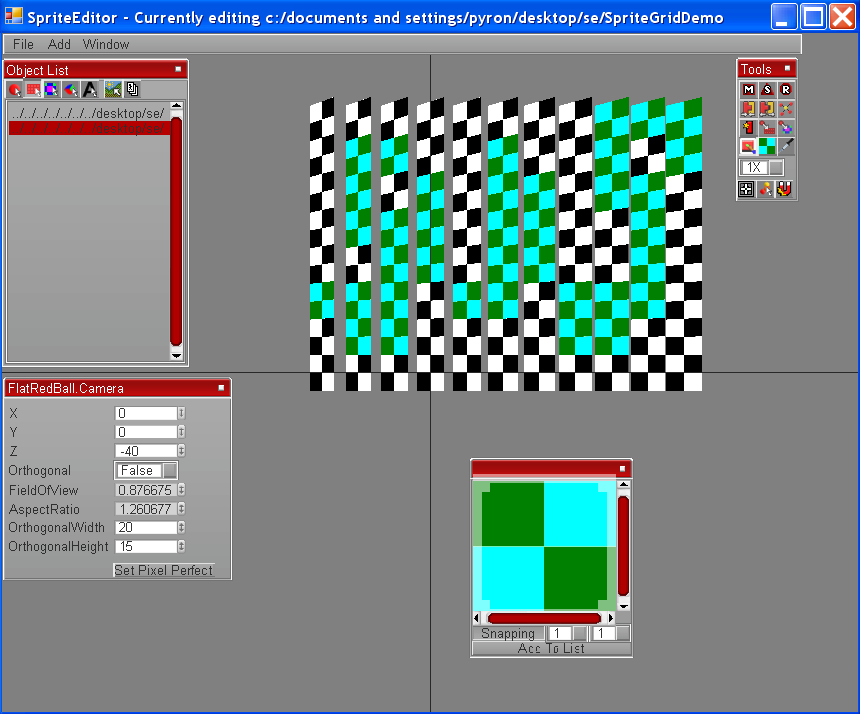

And, that's all there is to it.

### Files Used In This Tutorial

(right-click file -> "Save Link As")

[Tile.JPG](../frb/docs/images/d/d1/Tile.JPG)

[RedTile.JPG](../frb/docs/images/8/8c/RedTile.JPG)

[GreenTile.JPG](../frb/docs/images/8/8e/GreenTile.JPG)

[SpriteGridDemo.scnx](../frb/docs/index.php)
